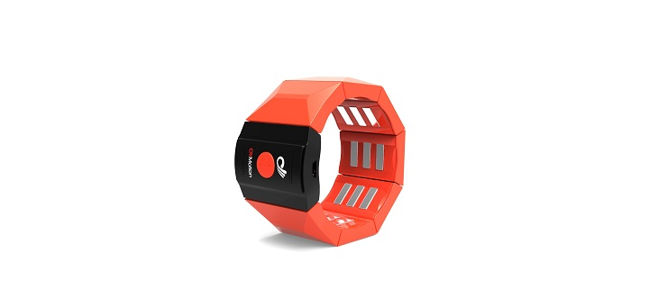
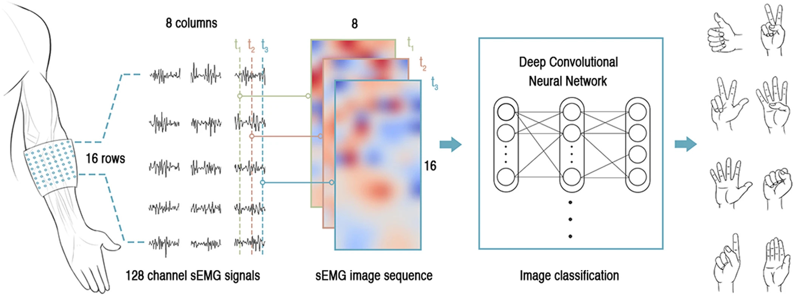
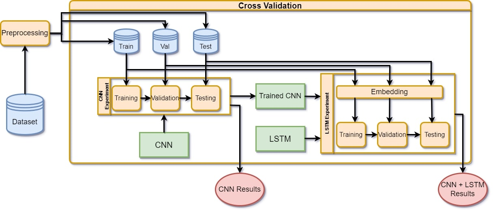
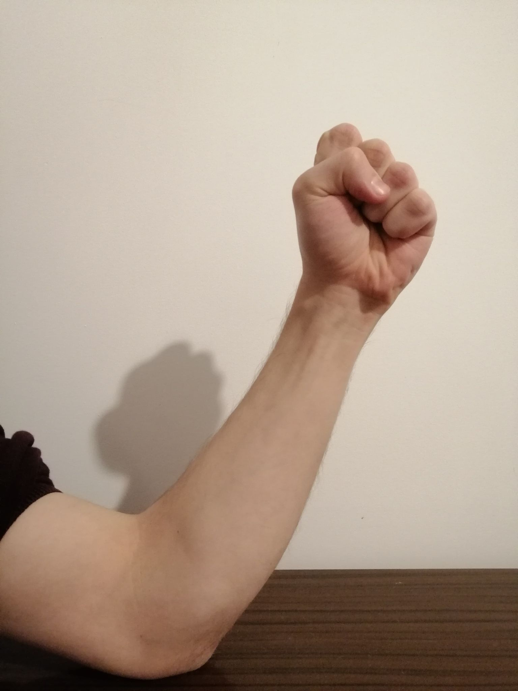
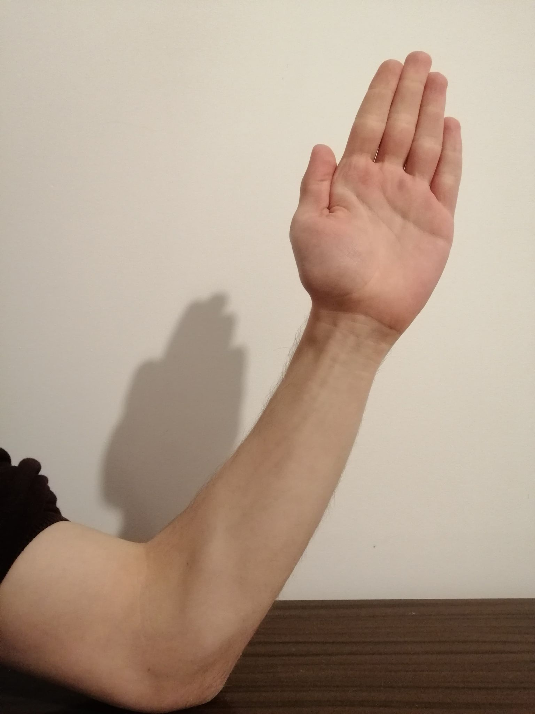
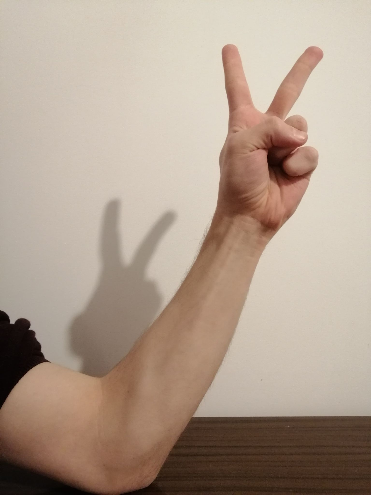

# EMG Analysis
## Introduction

Main idea of this project is to find the ways to extract as much information from EMG data. We have defined our problem as gesture recognition based on data extracted form EMG armband, which is recording signals form arm of a subject.

## EMG

**EMG (Electromyographic) signals** are probably the easiest kind of signals from human body to obtain, as they don’t require invasive methods of implanting recording devices. In the same time they are susceptible to noise from electrical devices, skin and on top of that don’t transfer too much information on their own. Yet there are many usages for EMG data, as they can be used in games controllers or to control some mechanical devices and even prostheses to certain degree. All of that without inputting any electrodes into human body.

## Device

Solutions created by us are meant to be used commercially to create said control devices. To achieve that we decided to use easiest to obtain and simplest EMG armband from OYMotion Technologies Co. (www.oymotion.com). Model we use is gForcePro+ EMG Armband (<http://www.oymotion.com/en/product32/149>), which offers opensource API for gathering signals from armband.

<p style="text-align: center;">

</p>
<p style="text-align: center;"><em>Pic. 1. gForcePro+ EMG Armband</em></p>

### Specification

| Features              | Value                                                                    |
|-----------------------|--------------------------------------------------------------------------|
| Sample rate           | max 1000Hz                                                               |
| ADC                   | <p>8bit (max 1000Hz sample rate)</p><p>12bit (max 500Hz sample rate)</p> |
| Channels              | 8                                                                        |
| Gain                  | 1200                                                                     |
| Filter                | 20-500Hz hardware band pass                                              |
| IMU                   | 9-axis IMU motion sensors                                                |
| IMU Sample rate       | 50 Hz                                                                    |
| Pose Data Sample Rate | 50 Hz                                                                    |
| Radio Frequency       | BLE 2402-2480MHZ                                                         |

## Inspiration

Our approach is based on method presented in an article “Gesture recognition by instantaneous surface EMG images”[<sup>1</sup>](#references). The Idea is to treat set of signals as picture. We are taking EMG signals from each electrode of armband and for each instance of measurement and turn them in picture by treating each electrode as pixel. It is crucial to place those pixels in the same positions in relation to each other, as were electrodes in armband which pixels are representing, to properly represent relationship between signals in space. In case of our armband we will have pictures 1x8. 

For example if we have recording of signals which is 10 seconds long with sampling frequency 1000 Hz from gForcePro+ EMG Armband, we will have series of 10000 pictures 1x8.

Data represented in that way we can feed to convolutional neural networks and apply many methods of analysis used usually for computer vision problems. In the same time we can still perform many procedures of preprocessing signals, before turning them into picture.

<p style="text-align: center;">

</p>
<p style="text-align: center;"><em>Pic. 2. Depiction of method from article <sup>1</sup></em></p>

## Methods

There are some papers that are trying to include information about order of measurements into classification process. It is done usually in 2 ways:

* Adding another dimension to pictures, which is time. In case of one dimensional data it creates spectrogram and in case of two-dimensional data it adds another channels
* Using recurrent networks

What is unique about our approach is fact that we are testing both of those methods, even mixed together, and we are using recurrent network in our own way. 

After training convolutional network on data in random order, we are removing the last layer of it and use it as embedding for LSTM. Then we can train LSTM with embedded data treated as series with preserved order. Other approaches from papers are usually using recurrent networks differently, for example:

* Putting LSTM before CNN and turning window from series of signals into picture. That way we are losing information about real placement of electrodes in space and there is no reason to use CNN instead of regular fully connected network.
* Putting LSTM after CNN, but feeding it with vector of extracted features, treated as series. That way LSTM does not take in account information about previous measures in the series.

By training both models separately we are also reducing time needed to train both networks if they would be connected and trained together.

<p style="text-align: center;">

</p>
<p style="text-align: center;"><em>Pic. 3. Pipeline</em></p>

## Datasets

Most of existing datasets are created with armband placed on forearm. It is good if we want to create controllers for games, apps and mechanical devices, but not for prostheses, because they are meant for people whose arms are cut not only at wrist, but also at any height of forearm. Some people will need control devices placed higher on upper arm. We wanted to create such dataset and compare results from both places. 

We have created 2 datasets:

- KNIBM-low:
  - armband size: 1x8
  - gestures number: 3
  - subjects: 10, both man and women
  - splitting data: different subjects in test, validation and training datasets
  - armband location: forearm
- KNIBM-high:
  - armband size: 1x8
  - gestures number: 3
  - subjects: 10, both man and women
  - splitting data: different subjects in test, validation and training datasets
  - armband location: upper arm

We are also performing experiments on 3 already created datasets:

- CapgMyo DB-a [<sup>1</sup>](#references):
  - armband size: 16x8
  - gestures number: 8
  - subjects: 18, both man and women
  - splitting data: the same subjects and gestures, but different recording sessions in test, validation and training datasets
  - armband location: forearm
- MyoArmband [<sup>2</sup>](#references):
  - armband size: 1x8
  - gestures number: 7
  - subjects: 36, both man and women
  - splitting data: different subjects in test, validation and training datasets
  - armband location: forearm
- NinaPro DB1 [<sup>3</sup>](#references) [<sup>4</sup>](#references) [<sup>5</sup>](#references):
  - armband size: 1x8 with 2 additional electrodes placed higher on arm, outside of armband
  - gestures number: 52
  - subjects: 27, both man and women
  - splitting data: the same subjects and gestures, but different recording sessions in test, validation and training datasets
  - armband location: forearm

## Data Acquisition Protocol

Subjects were asked to put their left arm on their elbow on the table and relax it. After that they were given signal to perform gesture, and after they have shown clear gesture, the recording has started. We recorded gestures for approximately 10 seconds but in dataset recordings will be down sampled to the shortest, so they can be a little shorter. Between each gesture there were at least 10 seconds of break. We have recorded 10 sessions of gestures per each person and between sessions there were at least 30 seconds of break.
<p style="text-align: center;">



</p>
<p style="text-align: center;"><em>Pic. 4. Gestures from dataset</em></p>

## Results
All experiments were performed using cross validation. We are using WandB to record the course of the experiments.
https://wandb.ai/grigori200/EMG%20Armband

## Future plans

Additional signal filtering:

- an anti-hum notch filter to filter out 50HZ or 60HZ power line noise
- a lowpass filter to filter out noises above 150HZ
- a highpass filter to filter out noises below 20HZ
- extended Kalman filter

Augmentation:

- RMS
- MAV
- EMA
- Generating additional data by moving signal values from left side of picture to right, to resemble rotating armband on arm.
- Short Time Fourier Transform
- mDWT
- CWT

Models:

- Connecting LSTM with CNN and training together
- XGBOOST
- testing other CNN's
- Pure LSTM (without CNN)

## How to use our code

### Packages

#### Windows
To run code on windows create new venv using Anaconda. You will need to split installation of packages from requirements.txt into 2 commands. It is caused by need of installing intel-openmp from different repository. Otherwise CUDA will not work properly. 
```
conda install --file requirements.txt -c pytorch -c nvidia -c anaconda -c conda-forge
```
```
conda install intel-openmp -c defaults -f
```

#### Linux
```
pip install -r requirements.txt
```
### WandB
To monitor our experiments we are using WandB. This framework requires crating an account and signing in from console. Run command bellow and paste your API key from here: [link](https://wandb.ai/authorize?_gl=1*shf5nj*_ga*ODQxODQyODQwLjE2NzY3MTkyMzg.*_ga_JH1SJHJQXJ*MTY3ODk2MzUwOS42LjAuMTY3ODk2MzUwOS42MC4wLjA.)
```
wandb login
```
After that you need to speciffy name of project
### Run experiments
Our experiments can be run by executing a file 
```
./experiments/experiments.py
```
### Downloading datasets
Datasets are downloaded automatically, when you first time create object representing specific dataset class. Those classes are placed in:
```
./datasets/frames/
```
Downloaded data will be placed in:
```
./data
```
Then data will be unzipped, compressed to .pkl file and placed inside folder <ins>OUTSIDE OF PROJECT</ins>:
```
../Data_pkl/
```
### <ins>!Warnings!</ins>
1. If you want to download dataset again delete data from both "../Data_pkl/" and from "../data"
2. If you want to applay data transformation after dataset is downloaded, but before it is converted to .pkl file, you should delete already existing .pkl file.

## References

1. Geng, W., Du, Y., Jin, W. et al. Gesture recognition by instantaneous surface EMG images. Sci Rep 6, 36571 (2016). https://doi.org/10.1038/srep36571

2. U. Côté-Allard *et al*., "Deep Learning for Electromyographic Hand Gesture Signal Classification Using Transfer Learning," in *IEEE Transactions on Neural Systems and Rehabilitation Engineering*, vol. 27, no. 4, pp. 760-771, April 2019, doi: 10.1109/TNSRE.2019.2896269. 

3. M. Atzori *et al*., "Building the Ninapro database: A resource for the biorobotics community," *2012 4th IEEE RAS & EMBS International Conference on Biomedical Robotics and Biomechatronics (BioRob)*, Rome, Italy, 2012, pp. 1258-1265, doi: 10.1109/BioRob.2012.6290287.

4. Atzori, M., Gijsberts, A., Castellini, C. et al. Electromyography data for non-invasive naturally-controlled robotic hand prostheses. Sci Data 1, 140053 (2014). <https://doi.org/10.1038/sdata.2014.53>

5. M. Atzori et al., "Characterization of a Benchmark Database for Myoelectric Movement Classification," in IEEE Transactions on Neural Systems and Rehabilitation Engineering, vol. 23, no. 1, pp. 73-83, Jan. 2015, doi: 10.1109/TNSRE.2014.2328495.
